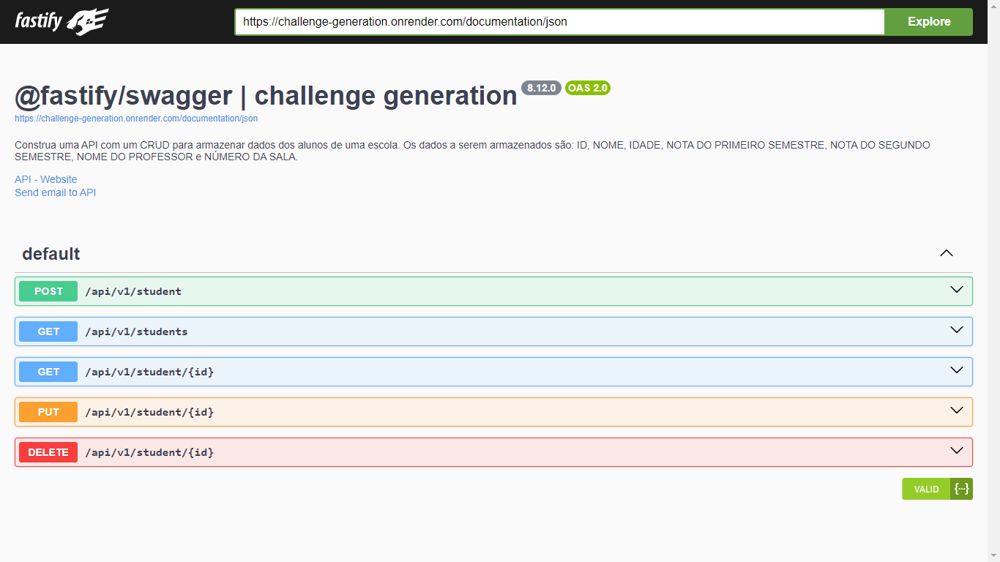

## DESAFIO ONLINE | PROGRAMAÇÃO NA PRÁTICA

### 💻 Desenvolvedor/a Web/Cloud - AWS Practitioner

* Construa uma API com um CRUD para armazenar dados dos alunos de uma escola.

* 📋 Os dados a serem armazenados são: ``Id``, ``nome``, ``idade``, ``nota do primeiro semestre``, ``nota do segundo semestre``, ``nome do professor`` e ``número da sala``.

* 🛢️ Os dados deverão ser armazenados em um banco de dados relacional podendo ser (``MySql``, ``SqlServer``, ``Postgres``)

* 👨‍💻 A linguagem, framework e ORM são livres, ou seja pode ser usado qualquer tecnologia que usa uma linguagem de programação e um framework para criação do projeto.

---

### 🚀 Tecnologia utilizadas.

| dependencies | devDependencies |
|------|------|
| 1. [@fastify/swagger](https://github.com/fastify/fastify-swagger): Um plug-in Fastify para servir esquemas Swagger (OpenAPI v2) ou OpenAPI v3, que são gerados automaticamente a partir de seus esquemas de rota ou de um esquema Swagger/OpenAPI existente.| 1. [eslint](https://github.com/eslint/eslint): ESLint é uma ferramenta para identificar e relatar padrões encontrados em código ECMAScript/JavaScript. |
|2. [@fastify/swagger-ui](https://github.com/fastify/fastify-swagger-ui): Um plugin Fastify para servir a UI do Swagger.| 2. [prisma](https://github.com/prisma/prisma): Prisma é um kit de ferramentas de banco de dados de código aberto. Inclui um ORM JavaScript/TypeScript para Node.js |
|3. [@prisma/client](https://www.prisma.io/docs/concepts/components/prisma-client): Prisma Client é um construtor de consultas gerado automaticamente e com tipo seguro, adaptado aos seus dados.| 3. [tsx](https://github.com/esbuild-kit/tsx): TypeScript Execute (tsx): Node.js aprimorado com esbuild para executar arquivos TypeScript e ESM |
|4. [fastify](https://github.com/fastify/fastify): Framework web rápido e de baixo custo, para Node.js. Um servidor eficiente implica menor custo de infraestrutura, melhor capacidade de resposta sob carga e usuários satisfeitos.| 4. [typescript](https://github.com/Microsoft/TypeScript): TypeScript é uma linguagem para desenvolvimento de JavaScript em escala de aplicativo |
|5. [zod](https://github.com/colinhacks/zod): Zod é uma biblioteca de declaração e validação de esquema TypeScript com inferência de tipo estático.| 5. [@types/node](https://github.com/DefinitelyTyped/DefinitelyTyped): Definições TypeScript para Node.js |

---

### 🧭 Orientações.
* Não esqueça de implementar o swagger em sua aplicação para criar a documentação e acesso aos endpoints como na imagem abaixo.

* Realize o deploy dessa aplicação em serviços de hospedagem gratuita como [Heroku](https://www.heroku.com/), [Vercel](https://vercel.com/), [Netlify](https://www.netlify.com/), [Render](https://render.com/) etc.
* Ao final, você precisará disponibilizar o link de acesso dessa aplicação. Para isso, acesse a plataforma do processo seletivo e faça o envio do link na etapa.
> Projeto em produção hospedado no [Render](https://render.com/), acesse 👉 [Desafio Generatiom em hospedado](https://challenge-generation.onrender.com/documentation)🔗

---

 
 

  feito com ❤️ por
  <a href="https://www.github.com/ias4g">Izael Silva</a>
  para o desafio online da
  <a href="https://brazil.generation.org/">Generation Brasil</a>

